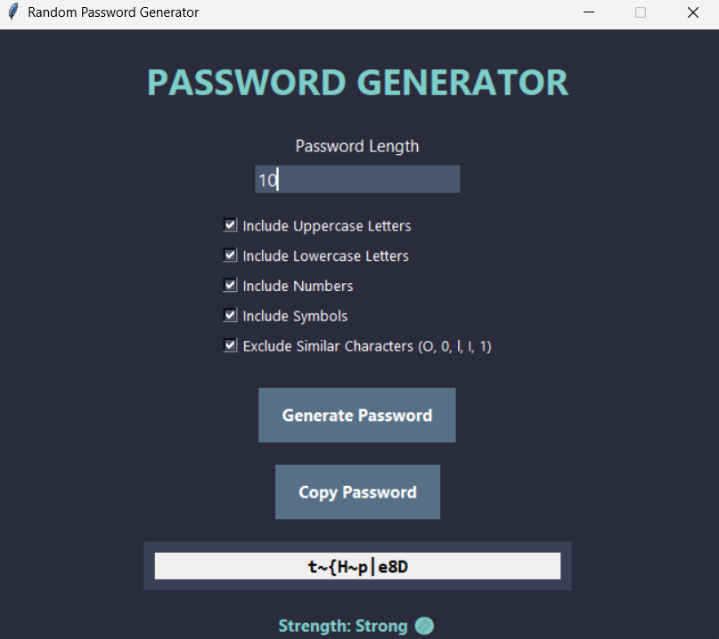
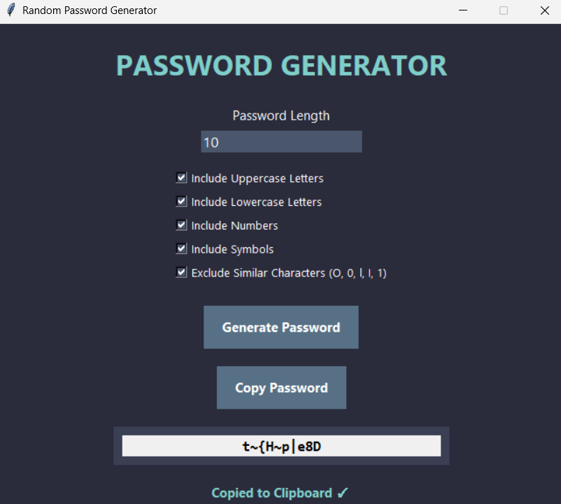

# Random Password Generator

A modern GUI-based Random Password Generator built using Python and Tkinter.

## Features

- Generate secure random passwords
- Custom password length
- Include:
  - Uppercase letters
  - Lowercase letters
  - Numbers
  - Symbols
- Exclude similar characters (O, 0, l, I, 1)
- Password strength indicator
- Copy password to clipboard
- User-friendly modern interface

## Technologies Used

- Python
- Tkinter
- Pyperclip

## Installation

Clone the repository:

```bash
git clone https://github.com/YOUR_USERNAME/OIBSIP-Random-Password-Generator.git
```

Install dependencies:

```bash
pip install -r requirements.txt
```

Run:

```bash
python main.py
```

## Screenshots

### Main Interface


### Generated Password



### Copy Password



## Author

Created as part of the Oasis Infobyte Internship Program.
